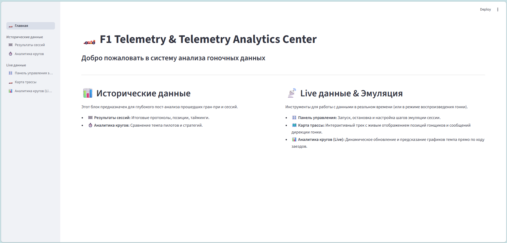
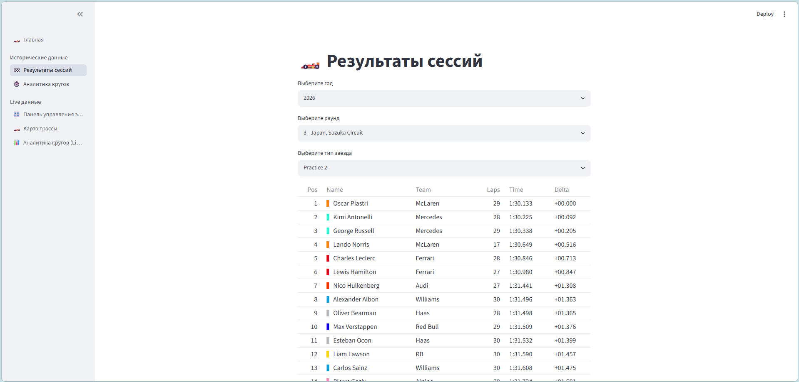
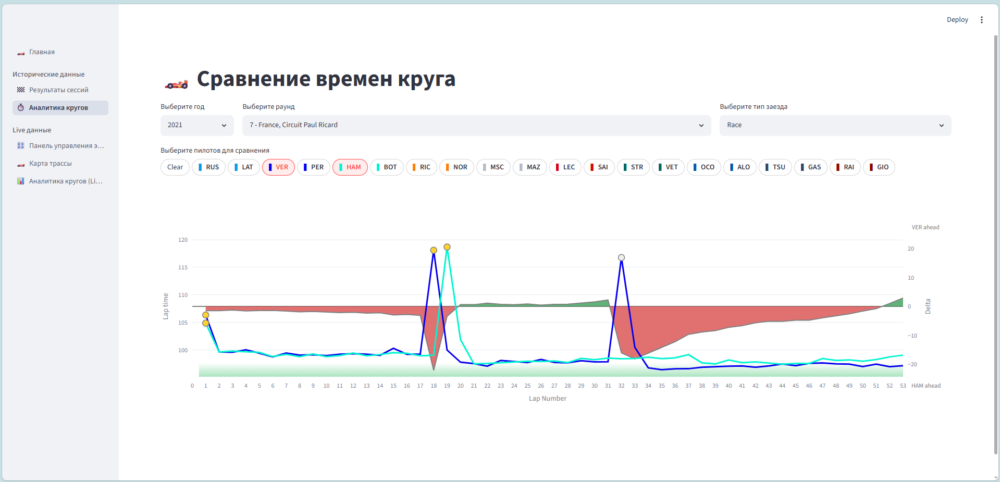
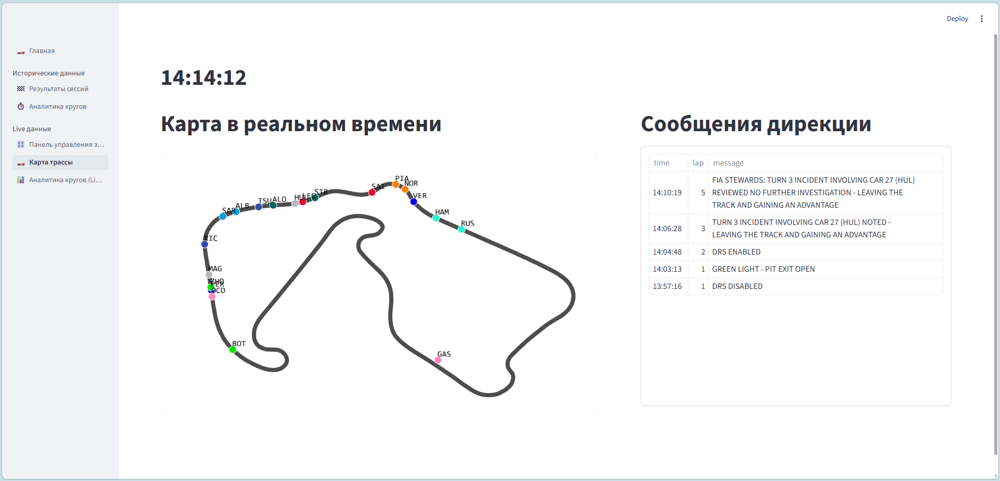
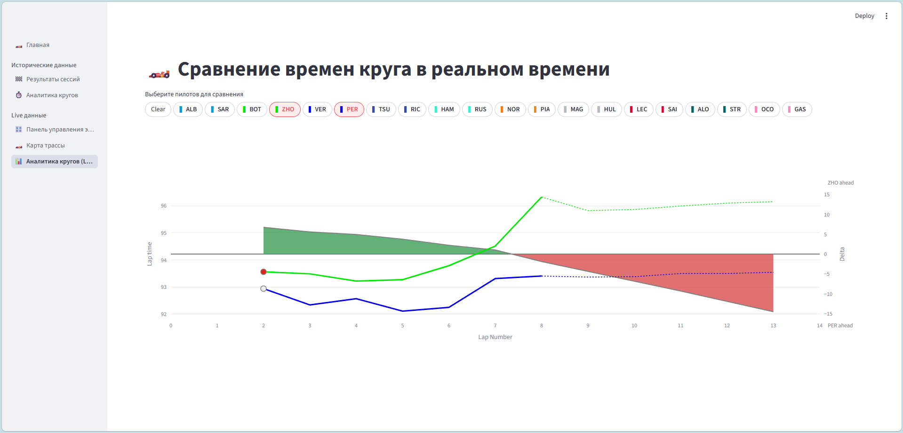

# 🏎️ F1 Telemetry & Live Analytics Center

Интерактивное веб-приложение на базе Streamlit для анализа телеметрии, таймингов и результатов гоночных сессий Formula 1. Проект сочетает в себе работу с историческими архивами данных и модуль симуляции/мониторинга заездов в реальном времени.

## 🛠️ Стек технологий
* **Язык разработки:** Python 3.10+
* **Frontend:** Streamlit, Plotly, PyDeck
* **Backend:** FastAPI (REST API, WebSockets, Async-подключения)
* **Анализ данных и ML:** FastF1, Pandas, Градиентный бустинг (XGBoost)
* **Инфраструктура:** Docker, Docker Compose, PostgreSQL

---

## 📂 Структура проекта и модули

Приложение имеет модульную структуру, разделенную на логические блоки на боковой панели:

```📂 F1 Analytics Project Structure
├── app/                        # [Фронтенд] Клиентское приложение на Streamlit
│   ├── main.py                 # Главный экран и ядро навигации
│   └── pages/                  # Страницы аналитики и мониторинга
│       ├── results.py
│       ├── pace.py
│       ├── emulation.py
│       ├── pace_real_time.py
│       └── real_time_map.py
│
├── server_app/                 # [Бэкенд] REST API сервис на FastAPI
│   ├── main.py                 # Точка входа и инициализация FastAPI приложения
│   ├── info/                   # Эндпоинты и схемы для общей информации (статус, метаданные)
│   ├── historical/             # Ручки для работы с архивными данными (FastF1, результаты)
│   ├── live/                   # Ручки для работы с данными в реальном времени
│   └── emulation/              # Логика и управление шагами эмулятора гонки
│   └── parser/                 # Логика для парсинга новых данных
│   └── real_time.txt           # Файл для записи real-time данных 
│
├── analyze/                    # [Research] Разработка и обучение ML-модели (Исключено из билда)
│
├── parser/                     # [Data Scraping] Парсеры для сбора дополнительных гоночных данных (Исключено из билда)
│
├── docker-compose.yml          # Конфигурация Docker для локального развертывания всех сервисов
└── init.sql                    # Скрипт инициализации базы данных
```


## ⚙️ Принцип работы системы

**Архитектура проекта построена на строгом разделении ответственности между интерфейсом, бэкендом и слоем обработки данных. Взаимодействие делится на два ключевых сценария:**

### 1. Анализ исторических данных (REST API)

- Страницы Результаты сессий и Аналитика кругов работают в классическом режиме "запрос-ответ".

- Streamlit отправляет HTTP GET-запросы к эндпоинтам бэкенда в модуль server_app/historical/.

- FastAPI выполняет оптимизированные запросы к базе данных, агрегирует телеметрию FastF1 и возвращает структурированный JSON, который Streamlit преобразует в интерактивные графики.


### 2. Обработка Live-данных, Эмуляция и ML-прогнозирование

Мониторинг реального времени завязан на реактивную событийно-ориентированную модель обработки потока:

- Слой сбора данных (Ingestion): Входящий поток (будь то реальный API-стрим гонки или запущенный эмулятор из панели управления (server_app/emulation/emulate.py)) непрерывно записывается в буферный файл server_app/real_time.txt.

- Фоновый парсер (server_app/emulation/process_real_time_data.py): Специальный фоновый скрипт непрерывно отслеживает изменения файла real_time.txt. Как только в файле появляются новые строки, скрипт парсит их и мгновенно перезаписывает специальные real-time таблицы в базе данных.

- Инференс ML-модели (Gradient Boosting): Внутри сервиса server_app/live развернута обученная модель градиентного бустинга. При поступлении новых live-данных бэкенд на лету рассчитывает предиктивное время 5 следующих кругов для каждого пилота. На фронтенд уходят уже готовые предсказания, что полностью разгружает Streamlit-клиент.

- Доставка данных на фронтенд:

    - Графики темпа (pace_real_time.py): Периодически опрашивают эндпоинты server_app/live/ через быстрые REST-запросы, получая готовые массивы времен кругов и ML-прогнозы.

    - Карта трассы (real_time_map_ws.py): Для плавного движения болидов используется WebSocket-соединение с FastAPI. Координаты машин стримятся с высокой частотой ~4 Гц, обеспечивая живую анимацию трека без перезагрузки интерфейса.


## 🖼️ Интерфейс приложения

Главный экран приложения. Приветственная панель и навигационный хаб.



### Блок: Исторические данные
Итоговые протоколы прошедших Гран-при и аналитика кругов прошедших гонок.




### Блок: Live данные
Карта трассы и сообщения дирекции гонки в реальном времени. Аналитика кругов гонки с предсказаниями в реальном времени.






---

## 🔮 Будущие улучшения (Roadmap)

1. **Автоматический стриминг реальных Live-данных:** Разработка коннектора к внешним API (например, интеграция с официальными live-таймингами fastf1) для автоматического переключения системы с режима эмуляции на обработку реального прямого эфира уик-энда.
2. **Интеграция Real-Time результатов на фронтенд:** Вывод полноценной live-таблицы результатов (текущие отрывы между пилотами, интервалы, номер текущего круга сессии). Инфраструктура со стороны базы данных уже полностью подготовлена (таблица создана и наполняется), осталось реализовать эндпоинты в FastAPI и компоненты отображения в Streamlit.
3. **Поддержка всех типов сессий (Свободные практики и Квалификации):** Расширение логики парсера и структуры FastAPI-схем. На данный момент проект оптимизирован под гоночные сессии (Race). Поскольку структура данных, логика телеметрии и форматы таймингов в практиках (FP1/FP2/FP3) и квалификациях (Q1/Q2/Q3) отличаются, планируется добавить для них отдельные пайплайны обработки данных.


## 🚀 Инструкция по запуску проекта через Docker Compose

Проект состоит из трех основных компонентов:
1. **База данных:** PostgreSQL 16 (с автоматической инициализацией структуры и данных).
2. **Бэкенд (`server_app`):** FastAPI сервер, работающий внутри изолированного контейнера.
3. **Фронтенд (`streamlit_app`):** Streamlit интерфейс для визуализации данных.

---

### 🛠️ Пошаговый запуск

#### Шаг 1: Подготовка файлов окружения
В корневой директории проекта (там, где лежит `docker-compose.yml`) создайте файл с именем **`.env`** и скопируйте в него следующие переменные:

```env
DB_PASSWORD=pass
DB_USER=user
SERVER_APP_PORT=8000
```

#### Шаг 2: Сборка и запуск контейнеров
Откройте терминал в корне проекта и выполните команду для сборки образов и запуска сервисов в фоновом режиме:

```bash
docker compose up --build -d
```
---

### 🌐 Доступ к сервисам после запуска

После успешного старта вы можете получить доступ к приложениям со своего компьютера:

* **FastAPI Backend:** [http://localhost:8000](http://localhost:8000) (Интерактивная документация API доступна по адресу [http://localhost:8000/docs](http://localhost:8000/docs))
* **Streamlit Web App:** [http://localhost:8501](http://localhost:8501)
* **PostgreSQL DB:** `localhost:5432` (для подключения через внешние клиенты вроде DBeaver или DataGrip)